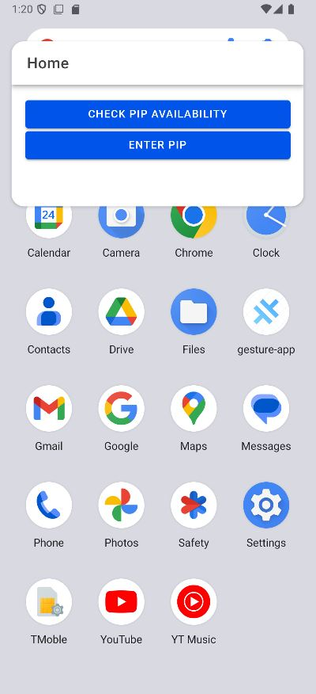

# capacitor-pip

Capacitor plugin for picture in picture feature, available for Android.

## Install

```bash
npm install capacitor-pip
npx cap sync
```

## API

<docgen-index>

* [`isPiPAvailable()`](#ispipavailable)
* [`isPipEnable()`](#ispipenable)
* [`startPiPMode(...)`](#startpipmode)
* [`openSettings()`](#opensettings)
* [Interfaces](#interfaces)

</docgen-index>

<docgen-api>
<!--Update the source file JSDoc comments and rerun docgen to update the docs below-->

### isPiPAvailable()

```typescript
isPiPAvailable() => Promise<{ available: boolean; }>
```

**Returns:** <code>Promise&lt;{ available: boolean; }&gt;</code>

--------------------


### isPipEnable()

```typescript
isPipEnable() => Promise<{ enable: boolean; }>
```

**Returns:** <code>Promise&lt;{ enable: boolean; }&gt;</code>

--------------------


### startPiPMode(...)

```typescript
startPiPMode(options?: { aspectRatio?: IRatio | undefined; } | undefined) => Promise<{ success: boolean; }>
```

| Param         | Type                                                         |
| ------------- | ------------------------------------------------------------ |
| **`options`** | <code>{ aspectRatio?: <a href="#iratio">IRatio</a>; }</code> |

**Returns:** <code>Promise&lt;{ success: boolean; }&gt;</code>

--------------------


### openSettings()

```typescript
openSettings() => Promise<void>
```

--------------------


### Interfaces


#### IRatio

| Prop         | Type                |
| ------------ | ------------------- |
| **`height`** | <code>number</code> |
| **`width`**  | <code>number</code> |

</docgen-api>

## How to used

Quick example of how to use, following provider pattern

#### Provider

```typescript

import { Injectable } from '@angular/core';
import { PictureInPicture } from 'capacitor-pip';

@Injectable({
  providedIn: 'root',
})
export class PiPProvider {
  async isAvailable(): Promise<boolean> {
    const result = await PictureInPicture.isPiPAvailable();
    return result.available;
  }

  async isEnable(): Promise<boolean> {
    const result = await PictureInPicture.isPipEnable();

    return result.enable;
  }

  async start(width: number = 16, height: number = 9): Promise<boolean> {
    const pip = await PictureInPicture.startPiPMode({
      aspectRatio: { width, height },
    });

    return pip.success;
  }

  async openSetting(): Promise<void> {
    return await PictureInPicture.openSettings();
  }
}


```

#### Component

```typescript

import { Component } from '@angular/core';
import {
  IonButton,
  IonHeader,
  IonToolbar,
  IonTitle,
  IonContent,
  ToastController,
} from '@ionic/angular/standalone';
import { PiPProvider } from '../services/pip.service';

@Component({
  selector: 'app-home',
  templateUrl: 'home.page.html',
  styleUrls: ['home.page.scss'],
  imports: [IonButton, IonHeader, IonToolbar, IonTitle, IonContent],
})
export class HomePage {
  constructor(
    private pipProvider: PiPProvider,
    private toastCtrl: ToastController
  ) {}

  async checkPiP() {
    const available = await this.pipProvider.isAvailable();

    const toast = await this.toastCtrl.create({
      message: 'PiP is available',
      duration: 3000,
      position: 'bottom',
    });

    available ? toast.present() : alert('PiP is not available on this device');
  }

  async enterPiP() {
    const isEnable = await this.pipProvider.isEnable();

    console.log(isEnable);

    isEnable
      ? await this.pipProvider.start()
      : this.pipProvider.openSetting();
  }
}

```

```html

<ion-header [translucent]="true">
  <ion-toolbar>
    <ion-title>
      Home
    </ion-title>
  </ion-toolbar>
</ion-header>

<ion-content [fullscreen]="true">
  <ion-content class="ion-padding">
    <ion-button expand="block" (click)="checkPiP()">Check PiP Availability</ion-button>
    <ion-button expand="block" color="primary" (click)="enterPiP()">Enter PiP</ion-button>
  </ion-content>
</ion-content>

```
#### Result




---

🤝 Contributing

Contributions are welcome! Please open an issue GitHub Issue or PR on GitHub PR